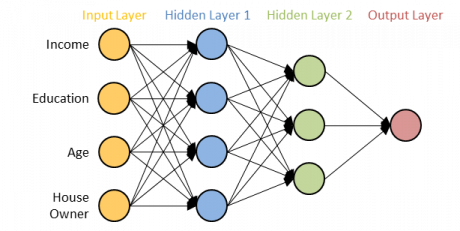
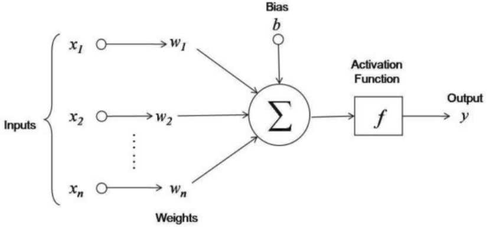

### Introduction
Any mass produced car today is built through an __[assembly line](https://en.wikipedia.org/wiki/Assembly_line)__ concept. This was idealized by Sir Henry Ford in early 20th century. Here is a simplified picture of what it looks :

[source](https://blog.frankfurt-school.de/wp-content/uploads/2018/10/1-460x231.png)

Wondering why this concept is described on this article on Neural Networks? It's because of the uncanny resemblence of both these concepts.

Suppose a startup is building assembly line in a car factory from scratch. Now suppose they don't know much about which people to hire in which team and they think of doing this on a trial and error basis. The assembly line consists of say 4 teams - Steel parts, Engines, Accessories and  Electronincs. They hire some people in each team and build a prototype and then compare it with the actual specifications of the car they want to build. This car will never be perfect and they need to make changes in necessary team so that the right person is at the right job. They again build the car and compare with the ideal design. This way they improves their car and makes it closer to the ideal design. 

As we saw in an assembly line there are groups of people doing a specific task similar to a layers of neurons in an artificial neural network(ANN). The products flows from one group to the other and on each level there is a important addition is made to the product. Similarly the output from one layer goes as input to the next layer in ANN. Here at the begining you assign people without knowing their proficiency and similary in a ANN the first time each layer is randomly created. Finally you compare the built car to the product you wish to build which is same a comparing the output of a neural network with the given output. Then you start to change the composition each groups of people to make the ideal car. In ANN you adjust the weights of each layer to get the final output as close as possible to the given value.

### Overview of Neural Networks
Here is how a very simplified ANN looks like :

[source](https://blog.frankfurt-school.de/wp-content/uploads/2018/10/1-460x231.png)

Here we want to predict the probability of them opting for a life insurance policy. We have variables as - income, age, education and house owner or not. These variables are given as input in the first layer and then output as some function say $$Y_i = W_i * X_i + b_i$$ where $$X_i$$ are the input parameters,$$W_i$$ are the weights and $$b_i$$ are the bias for a layer. This process happens for all the neurons in each layer. And the output of one layer is fed as input to the next one. 

If you are wondering why these are named as "neural networks", it is because their functioning is very similar to that of neurons in our nerves and brains.  

[source](https://www.researchgate.net/profile/Ana_Neves9/publication/320384373/figure/fig2/AS:682337809469452@1539693419868/The-biological-neuron.png)                                              

[source](https://miro.medium.com/max/1302/1*UA30b0mJUPYoPvN8yJr2iQ.jpeg)

In the above diagram of a single neuron, you can see how the output is computed inside a single neuron. The bias term and the weights and activation functions are specific to any particular layer of neurons. Generally keep the $$b$$ constant for each layer and we select $$W_i$$ based on the adjustment required. As discussed earlier we first compute a output $$Y$$ and compare it actual output $$Y_o$$. Then we find error term $${\delta} = Y - Y_o $$ and adjust the weights as $$ \delta{W} = W_i * {\delta} $$ . This process is repeated until the error term $${\delta}$$ reaches its threshold limit and does not change much. 
Then we get the final output and this process is fully automated. This leads us to the technical definition of neural networks:  **"Artificial neural networks (ANN) or connectionist systems are computer systems in which a number of processors are interconnected in a manner suggestive of the connections between neurons in a human brain and which is able to learn by a process of trial and error."**     

[source](https://www.merriam-webster.com/dictionary/neural%20network)

### Working of a Neural Network

The accuracy and functioning of a neural network depends on its hyper parameters - **A hyperparameter is a parameter whose value is set before the learning process begins. The values of parameters are derived via learning. Examples of hyperparameters include learning rate ($${\alpha}$$), the number of hidden layers (N) and batch size (K), activation fuction. The values of some hyperparameters can be dependent on those of other hyperparameters.**  

[source](https://en.wikipedia.org/wiki/Artificial_neural_network)

One of the most important hyperparameter is the activation function. This function is determined based on the problem statement. For e.g we want to predict probability - we will use a function which gives non-negative output like [Sigmoid function](https://en.wikipedia.org/wiki/Sigmoid_function). Here are the different types of activation functions 

 

[source](https://miro.medium.com/max/1200/1*ZafDv3VUm60Eh10OeJu1vw.png)

Two commonly used terminalogy used in ANN are Forward and Backward propagation. The movement from input to the output layer is called forward propagation. And adujusting the weights of each layer after getting the error term is called back propagation. 

[source](https://miro.medium.com/max/6216/1*6q2Rgd8W9DoCN9Wfwc_9gw.png)

Now the simplest type of neural network are the [Feed forward Neural Networks](https://en.wikipedia.org/wiki/Feedforward_neural_network). Here the flow is in single forward direction. We get the final output at the last layer which is further used to derive error term. Although based on requirement, we can tweak the structure of a neural network and feed output to some other layer. This leads to other types of ANN such as:
* Radial basis function Neural Network
* Kohonen Self Organizing Neural Network
* Recurrent Neural Network(RNN)
* Convolutional Neural Network
* Modular Neural Network

Details of these can be found [here](https://www.analyticsindiamag.com/6-types-of-artificial-neural-networks-currently-being-used-in-todays-technology/). 

### Application of Neural Networks

ANN has a wide range of applications. You might be wondering why there has been sudden focus on the use of ANN in every industry now-a-days. To give you some background, the theory of neural networks has been invented in the 1940's by Warren McCulloch and Walter Pitts . But due to the lack of computational power these theories was never materialized. Since 1975, the computing power of semiconductors is doubling every 2 years([Moore's Law](https://en.wikipedia.org/wiki/Moore%27s_law)) and this has led to the enormous number of calculation required for running ANN in smaller machines possible. Due to its use in both supervised and unsupervised learning problems ANN can be used for : 
* Medical diagnosis like cancer treatment.
* Classification and Pattern recognition.
* Data processing like filtering, clustering, etc.
* Computer vision applications like self-driving cars.
* Robotics and automation, etc.

### Conclusion 

We saw the problems which can be resolved across different type of industries. ANN is a really powerful tool for data scientists but there are some drawbacks of using neural networks. The main problem is the comprehendibility of a network. It is not easy for a person with no background in ANN to understand the working of a network. Therefore data consulting firms do not prefer using ANN as it becomes difficult to explain it to clients who do not have a technical background.

Another important drawback is that neural networks do not provide any equations which relates $$Y$$ to $$X$$. It is like a black box which only provides output with a high accuracy. But most of the cases it is important to know the behaviour of each feature/variable in impacting the final output. For eg. in liner regression equation: $$Y = a_1X_1 + a_2X_2 + a_3$$ the weights $$a_i's$$  determine which depend variable($$X$$) impacts more on the final output $$Y$$. This kind of inference cannot be "easily" found from a  neural network. Other metrics needs to be calculated to find out the impact of each variables since there are no equations. Therefore when we are only interested in building a model which gives most accurate result without caring for the variables and interference, ANN is the best possible solution.  

Hope I gave you some idea regarding neural networks. Please let me know any questions you have on my email. Cheers!
