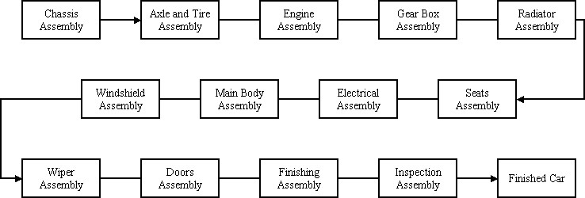
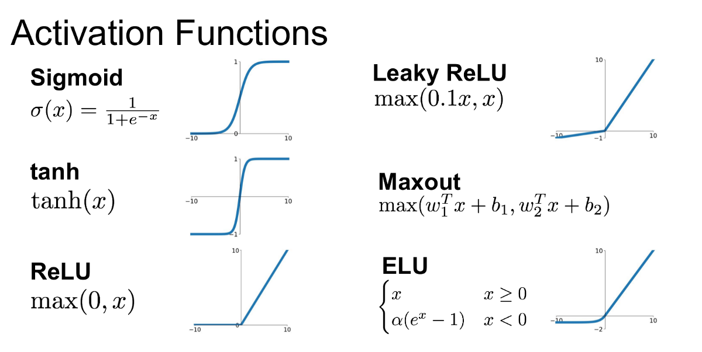
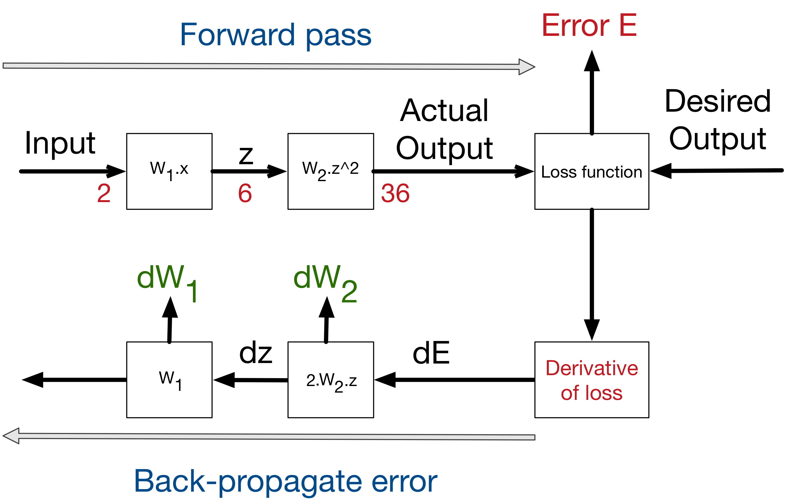

*/Just keep these above 2 lines/*

1.This is a Random blog.
2.This is used for various testing purposes.
3.Beware to see unusual, stupid, illogical, explicit content here.
4.I don't care what I post here so please don't judge me on that.

### Introduction
Any mass produced car today is built through an __[assembly line](https://en.wikipedia.org/wiki/Assembly_line)__ concept. This was idealized by Sir Henry Ford in early 20th century. Here is a simplified picture of what it looks :

[source](https://blog.frankfurt-school.de/wp-content/uploads/2018/10/1-460x231.png)

### Working of a Neural Network

The accuracy and functioning of a neural network depends on its hyper parameters - **A hyperparameter is a parameter whose value is set before the learning process begins. The values of parameters are derived via learning. Examples of hyperparameters include learning rate ($${\alpha}$$), the number of hidden layers (N) and batch size (K), activation fuction. The values of some hyperparameters can be dependent on those of other hyperparameters.**  

[source](https://en.wikipedia.org/wiki/Artificial_neural_network)

One of the most important hyperparameter is the activation function. This function is determined based on the problem statement. For e.g we want to predict probability - we will use a function which gives non-negative output like [Sigmoid function](https://en.wikipedia.org/wiki/Sigmoid_function). Here are the different types of activation functions 

 

[source](https://miro.medium.com/max/1200/1*ZafDv3VUm60Eh10OeJu1vw.png)

Two commonly used terminalogy used in ANN are Forward and Backward propagation. The movement from input to the output layer is called forward propagation. And adujusting the weights of each layer after getting the error term is called back propagation. 

[source](https://miro.medium.com/max/6216/1*6q2Rgd8W9DoCN9Wfwc_9gw.png)

Details of these can be found [here](https://www.analyticsindiamag.com/6-types-of-artificial-neural-networks-currently-being-used-in-todays-technology/). 

### Application of Neural Networks

ANN has a wide range of applications. You might be wondering why there has been sudden focus on the use of ANN in every industry now-a-days. To give you some background, the theory of neural networks has been invented in the 1940's by Warren McCulloch and Walter Pitts . But due to the lack of computational power these theories was never materialized. Since 1975, the computing power of semiconductors is doubling every 2 years([Moore's Law](https://en.wikipedia.org/wiki/Moore%27s_law)) and this has led to the enormous number of calculation required for running ANN in smaller machines possible. Due to its use in both supervised and unsupervised learning problems ANN can be used for : 
* Medical diagnosis like cancer treatment.
* Classification and Pattern recognition.
* Data processing like filtering, clustering, etc.
* Computer vision applications like self-driving cars.
* Robotics and automation, etc.

### Conclusion 

We saw the problems which can be resolved across different type of industries. ANN is a really powerful tool for data scientists but there are some drawbacks of using neural networks. The main problem is the comprehendibility of a network. It is not easy for a person with no background in ANN to understand the working of a network. Therefore data consulting firms do not prefer using ANN as it becomes difficult to explain it to clients who do not have a technical background.

Another important drawback is that neural networks do not provide any equations which relates $$Y$$ to $$X$$. It is like a black box which only provides output with a high accuracy. But most of the cases it is important to know the behaviour of each feature/variable in impacting the final output. For eg. in liner regression equation: $$Y = a_1X_1 + a_2X_2 + a_3$$ the weights $$a_i's$$  determine which depend variable($$X$$) impacts more on the final output $$Y$$. This kind of inference cannot be "easily" found from a  neural network. Other metrics needs to be calculated to find out the impact of each variables since there are no equations. Therefore when we are only interested in building a model which gives most accurate result without caring for the variables and interference, ANN is the best possible solution.  

Hope I gave you some idea regarding neural networks. Please let me know any questions you have on my email. Cheers!
